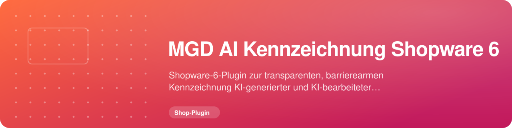

<!-- MGD-HEADER -->
<p align="center"><a href="https://Michael-Gahn.de"></a></p>

<p align="center"></p>

<p align="center">
  
  <a href="https://github.com/MichaelGahnDESIGN/MGD-AI-Kennzeichnung-Shopware-6/releases/latest"></a>
  
  <a href="https://Michael-Gahn.de"></a>
</p>
<!-- /MGD-HEADER -->

<div align="center">

# MGD AI Kennzeichnung Shopware 6

**Transparente und barrierearme Kennzeichnung KI-generierter oder KI-bearbeiteter Bilder in Shopware 6.**

[](LICENSE)
[](#voraussetzungen-und-kompatibilität)
[](#voraussetzungen-und-kompatibilität)
[](https://github.com/MichaelGahnDESIGN/MGD-AI-Kennzeichnung-Shopware-6/actions/workflows/quality.yml)
[](https://github.com/MichaelGahnDESIGN/MGD-AI-Kennzeichnung-Shopware-6/wiki)

[Release herunterladen](https://github.com/MichaelGahnDESIGN/MGD-AI-Kennzeichnung-Shopware-6/releases/latest) · [Wiki öffnen](https://github.com/MichaelGahnDESIGN/MGD-AI-Kennzeichnung-Shopware-6/wiki) · [Sicherheitslücke melden](SECURITY.md)

</div>

---

MGD AI Kennzeichnung erweitert Shopware-Medien um einen redaktionell gepflegten KI-Status. Im Storefront erscheint daraus ein kleines Textlabel direkt am Bild. Position, Darstellung und Sprache bleiben kontrollierbar, während Bilddatei, Alt-Text, responsive Quellen und Shopwares normaler Speicherweg unangetastet bleiben.

> [!IMPORTANT]
> Das Plugin **erkennt KI-Inhalte nicht automatisch**. Es analysiert keine Bilder, überträgt keine Medien an externe Dienste und entscheidet nicht, ob ein Bild rechtlich gekennzeichnet werden muss. Diese Entscheidung bleibt bei den verantwortlichen Menschen.

> [!WARNING]
> Das Plugin ist ein technisches Transparenzwerkzeug und **keine Rechtsberatung**. Kennzeichnungspflichten hängen von Inhalt, Einsatz, Vertrag, Plattformregeln und geltendem Recht ab.

## Dokumentation

Das [GitHub-Wiki](https://github.com/MichaelGahnDESIGN/MGD-AI-Kennzeichnung-Shopware-6/wiki) enthält das vollständige Handbuch. Seine Quellen liegen zusätzlich versioniert unter [`docs/wiki/`](docs/wiki), damit Änderungen über Git nachvollziehbar bleiben.

| Einstieg | Für wen? | Inhalt |
| --- | --- | --- |
| [Installation und Updates](https://github.com/MichaelGahnDESIGN/MGD-AI-Kennzeichnung-Shopware-6/wiki/Installation-und-Updates) | Shopbetreiber | ZIP, CLI, Backup, Update und Rückfall |
| [Bilder kennzeichnen](https://github.com/MichaelGahnDESIGN/MGD-AI-Kennzeichnung-Shopware-6/wiki/Bilder-kennzeichnen) | Redaktion | Status, Position, Theme, Vorschau und Speichern |
| [Sprache und Gestaltung](https://github.com/MichaelGahnDESIGN/MGD-AI-Kennzeichnung-Shopware-6/wiki/Sprache-und-Gestaltung) | Redaktion und Design | Automatisch, Deutsch, Englisch und sichere Designwerte |
| [Erlebniswelten und Hintergrundbilder](https://github.com/MichaelGahnDESIGN/MGD-AI-Kennzeichnung-Shopware-6/wiki/Erlebniswelten-und-Hintergrundbilder) | Redaktion | CMS-Elemente, Alternativtexte und KI-Philosophie |
| [Themes und individuelle Templates](https://github.com/MichaelGahnDESIGN/MGD-AI-Kennzeichnung-Shopware-6/wiki/Themes-und-individuelle-Templates) | Entwickler | Shopware-Integration, eigene Themes und Grenzen |
| [Datenschutz und Sicherheit](https://github.com/MichaelGahnDESIGN/MGD-AI-Kennzeichnung-Shopware-6/wiki/Datenschutz-und-Sicherheit) | Betreiber und Datenschutz | Datenfluss, Berechtigungen und Schutzmodell |
| [Fehlerbehebung](https://github.com/MichaelGahnDESIGN/MGD-AI-Kennzeichnung-Shopware-6/wiki/Fehlerbehebung) | Alle | Systematische Diagnose für Bilder und Labels |
| [Entwicklerarchitektur](https://github.com/MichaelGahnDESIGN/MGD-AI-Kennzeichnung-Shopware-6/wiki/Entwicklerarchitektur) | Entwickler | Domain, DAL, Resolver, Twig und Administration |
| [Tests und Releaseprozess](https://github.com/MichaelGahnDESIGN/MGD-AI-Kennzeichnung-Shopware-6/wiki/Tests-und-Releaseprozess) | Entwickler | Testmatrix, CI und reproduzierbares ZIP |

## Das Problem

KI-generierte und KI-bearbeitete Bilder können in Produktseiten, Kategorien, Erlebniswelten und redaktionellen Inhalten erscheinen. Ohne eine einheitliche Kennzeichnung müssen Redakteure Labels manuell in Bilder einbauen oder für jede Ausgabe eigene Templates pflegen. Das ist fehleranfällig, schwer übersetzbar und häufig nicht barrierefrei.

## Die Lösung

Das Plugin speichert am Shopware-Medium drei klar begrenzte Custom Fields:

- fachlicher KI-Status,
- gewünschte Ecke,
- helles, dunkles oder automatisches Erscheinungsbild.

Shopwares Thumbnail-Ausgabe liest diese Werte serverseitig, normalisiert sie gegen feste Positivlisten und ergänzt nur bei einem sichtbaren Status ein Label. Die Originaldatei wird weder überschrieben noch mit einem Wasserzeichen versehen.

Sprache und globale Darstellungswerte liegen in Shopwares Systemkonfiguration und können dadurch je Verkaufskanal aufgelöst werden.

## Funktionen

- fünf redaktionelle Zustände: keine Kennzeichnung, vollständig KI-generiert, teilweise KI-generiert, mit KI verändert und Deepfake
- vier feste Positionen: oben links, oben rechts, unten links und unten rechts
- drei feste Themes: automatisch, hell und dunkel
- automatische Sprache nach Verkaufskanal sowie feste Ausgabe auf Deutsch oder Englisch
- lokale Vorschau direkt in der Shopware-Medienverwaltung
- Nutzung von Shopwares nativer Custom-Field-Speicheraktion und Rechteprüfung
- serverseitige Integration in das zentrale Shopware-Thumbnail-Template
- eigenes Erlebniswelten-Element für gekennzeichnete Hintergrundbilder
- optional vorbereitbare, zunächst unverknüpfte Erlebniswelt zur eigenen KI-Philosophie
- barrierearme Textkennzeichnung mit zusätzlichem Screenreader-Hinweis bei Deepfakes
- sichere Zahlenbereiche für Schriftgröße, Abstände, Radius und Hintergrundunschärfe
- keine externe Bilderkennung, Telemetrie, externen Schriften oder Tracking-Dienste
- reproduzierbares Release-ZIP und automatisierte Shopware-/PHP-Matrix

## Voraussetzungen und Kompatibilität

| Anforderung | Unterstützter Stand |
| --- | --- |
| Shopware | `~6.6.10` oder `~6.7.0` |
| PHP | `^8.2` |
| Browser | aktueller Browser mit normaler Shopware-6-Storefront-Unterstützung |
| Installation | Shopware-Administration oder CLI-Zugriff |
| Lizenz | `GPL-2.0-or-later` |

Version `0.1.1` wurde in frisch installierten, isolierten Shops mit Shopware `6.6.10.22` und `6.7.13.0` geprüft. Installation, Aktivierung, Administration- und Storefront-Build, Datenbankintegration, Sprachwahl, Medienvorschau, Erlebniswelten sowie Deinstallation mit und ohne Datenerhalt waren erfolgreich. Ein zusätzlicher produktiver Referenztest unter Shopware `6.7.13.0` ist in [Dokumentation/TableGuard-Live-Test-2026-08.md](Dokumentation/TableGuard-Live-Test-2026-08.md) anonymisiert zusammengefasst.

Andere Patchstände und vollständig eigene Themes benötigen weiterhin eine Staging-Prüfung.

## Schnellinstallation

### ZIP über die Shopware-Administration

1. Vorher Datenbank und `custom/plugins` sichern.
2. Das aktuelle ZIP unter [Releases](https://github.com/MichaelGahnDESIGN/MGD-AI-Kennzeichnung-Shopware-6/releases/latest) herunterladen.
3. In Shopware **Erweiterungen → Meine Erweiterungen → Erweiterung hochladen** öffnen.
4. ZIP hochladen, installieren und aktivieren.
5. Cache leeren und Theme kompilieren.
6. Administration, aktive Verkaufskanäle und mindestens ein Testmedium kontrollieren.

### Installation per CLI

Den im ZIP enthaltenen Ordner `MGDAIImageLabels` nach `custom/plugins/` kopieren und im Shopware-Projekt ausführen:

```bash
bin/console plugin:refresh
bin/console plugin:install --activate MGDAIImageLabels
bin/console cache:clear
bin/console theme:compile
```

Zugangsdaten und Datenbankkennwörter gehören ausschließlich in die geschützte Serverkonfiguration, niemals in Befehle, Issues oder das Repository.

## Bedienung: erste Kennzeichnung

1. **Inhalte → Medien** öffnen.
2. Ein Bildmedium auswählen.
3. Den Bereich **KI-Bildkennzeichnung** öffnen.
4. KI-Status wählen.
5. Optional Position und Theme für dieses Medium festlegen.
6. Vorschau kontrollieren.
7. Mit Shopwares vorhandener Custom-Field-Speicheraktion speichern.
8. Storefront sowie alle relevanten Bildgrößen kontrollieren.

Die Vorschau verändert noch keine Daten. Erst Shopwares Speicheraktion übernimmt die Auswahl. Die Bilddatei selbst bleibt unverändert.

## Kennzeichnungsarten und Sprache

| Auswahl in Shopware | Deutsches Label | Englisches Label | Verwendung |
| --- | --- | --- | --- |
| Keine KI-Kennzeichnung | kein Label | no label | keine sichtbare Ausgabe |
| Vollständig KI-generiert | `KI-GENERIERT` | `AI GENERATED` | Bild vollständig durch KI erzeugt |
| Teilweise KI-generiert | `TEILWEISE KI-GENERIERT` | `AI PARTIALLY GENERATED` | Bild enthält KI-generierte Bestandteile |
| Mit KI verändert | `MIT KI BEARBEITET` | `AI MODIFIED` | vorhandenes Bild wesentlich mit KI verändert |
| Deepfake | `AI DEEPFAKE` | `AI DEEPFAKE` | authentisch wirkende oder vergleichbare Manipulation |

Die Sprache steht standardmäßig auf **Automatisch**. Eine deutsche Verkaufskanalsprache erzeugt deutsche Texte; alle anderen Kontexte verwenden den englischen Fallback. Alternativ lässt sich Deutsch oder Englisch fest vorgeben. Der fachliche Status eines Mediums bleibt bei einem Sprachwechsel unverändert.

## Shopware, Erlebniswelten und Themes

Das Plugin erweitert Shopwares zentrales `sw_thumbnails`-Template und verwendet weiterhin Shopwares fertige Bildausgabe. `src`, `srcset`, `sizes`, Alt-Text, Titel, Lazy Loading und Zoomattribute werden nicht neu erfunden.

Zusätzlich stehen zur Verfügung:

- **Gekennzeichnetes Hintergrundbild:** eigenes Erlebniswelten-Element mit lokalem Bildmedium, festen Positionen, sicherer Hintergrundfarbe und redaktionellem Alternativtext.
- **KI-Philosophie:** eine berechtigte Admin-Aktion kann einmalig eine zweisprachige, unverknüpfte Erlebniswelt vorbereiten. Sie wird weder veröffentlicht noch automatisch einem Verkaufskanal zugeordnet.

> [!CAUTION]
> Direkt in HTML eingetragene ``-Elemente besitzen kein Shopware-Medienobjekt. Das Plugin kann dort keinen KI-Status auflösen. Auch ein Theme, das Shopwares Thumbnail-Template vollständig ersetzt, kann die Integration umgehen. Einzelheiten und sichere Integrationswege stehen im Wiki unter [Themes und individuelle Templates](https://github.com/MichaelGahnDESIGN/MGD-AI-Kennzeichnung-Shopware-6/wiki/Themes-und-individuelle-Templates).

## Datenschutz und Sicherheit

- keine Übertragung von Bildern an externe Dienste
- keine automatische Analyse oder Profilbildung
- keine eigenen Benutzerkonten, Zahlungsdaten oder Trackingdaten
- Speicherung der Auswahl in Shopwares vorhandenen Medien-Custom-Fields
- feste Status-, Positions- und Theme-Werte
- serverseitig begrenzte Zahlenwerte statt freier CSS-Eingaben
- Admin-Aktionen über Shopwares Authentifizierung, ACL und API-Kontext
- keine geheimen Schlüssel im Quellcode oder Release

Betreiber bleiben für Shopware-Updates, TLS, Serverhärtung, Backups, Rollen, Protokollschutz und ihre eigene Datenschutzerklärung verantwortlich. Mehr dazu: [Datenschutz und Sicherheit](https://github.com/MichaelGahnDESIGN/MGD-AI-Kennzeichnung-Shopware-6/wiki/Datenschutz-und-Sicherheit).

## Barrierefreiheit

Die Kennzeichnung besteht aus Text und nicht nur aus Farbe. Sie wird als Hinweis ausgezeichnet, blockiert keine Links oder Gesten und bleibt bei sehr kleinen Medien als zugänglicher Text erhalten. Deepfake-Status erhalten einen zusätzlichen Screenreader-Text. Dekorative Hintergrundbilder verwenden einen leeren Alternativtext; inhaltliche Bilder benötigen eine redaktionelle Beschreibung.

Die endgültige Barrierefreiheit hängt vom aktiven Theme, dessen Kontrasten, Zoomverhalten und der redaktionellen Pflege ab. Tastatur, Vergrößerung, Hell-/Dunkelmodus und Screenreader müssen im echten Shop geprüft werden.

## Update, Deinstallation und Rückfall

Vor jedem produktiven Update:

1. Datenbank und Plugin-Dateien sichern.
2. Releasehinweise und unterstützte Shopware-Versionen prüfen.
3. Update zuerst in Staging installieren.
4. Administration und Storefront testen.
5. Erst danach produktiv aktualisieren.

Bei der Deinstallation entscheidet Shopwares Option **Benutzerdaten behalten**, ob Plugin-Konfiguration und Custom-Field-Definitionen erhalten bleiben. Das Plugin schützt erhaltene Konfigurationswerte zusätzlich gegen Shopwares Standardwert-Überschreibung bei einer späteren Reinstallation. Ohne Datenerhalt entfernt es seine eindeutig zugeordneten Definitionen und Konfiguration. Bilddateien und fremde Felder bleiben unangetastet.

Medien können technisch ungenutzte Werte in Form verbliebener JSON-Schlüssel behalten, weil eine automatische Massenänderung aller Medien riskanter wäre. Der vollständige Ablauf steht unter [Deinstallation und Wiederherstellung](https://github.com/MichaelGahnDESIGN/MGD-AI-Kennzeichnung-Shopware-6/wiki/Deinstallation-und-Wiederherstellung).

## Grenzen und Fehlerbehebung

- Das Plugin beurteilt nicht, ob ein Bild tatsächlich KI-generiert ist.
- Rohe HTML-Bilder und vollständig eigene Thumbnail-Ausgaben werden nicht automatisch erkannt.
- Sehr kleine Bilder zeigen das Label visuell reduziert; der zugängliche Text bleibt erhalten.
- Eigene Theme-CSS-Regeln können Position und Kontrast beeinflussen.
- Ein verschwundenes Bild mit HTTP 404 ist kein Kennzeichnungszustand, sondern weist auf eine fehlende Datei, einen fehlenden Medieneintrag oder eine veraltete URL hin.

Die systematische Diagnose beginnt immer mit der direkten Bild-URL und dem Shopware-Medieneintrag – nicht mit CSS. Siehe [Fehlerbehebung](https://github.com/MichaelGahnDESIGN/MGD-AI-Kennzeichnung-Shopware-6/wiki/Fehlerbehebung).

## Entwicklung und Tests

```bash
composer install
npm ci
composer validate --strict
composer test:unit
composer analyse:phpstan
composer check:style
npm run test:administration
npm run test:storefront
vendor/bin/phpunit --fail-on-skipped tests/Structure/DocumentationAndReleaseTest.php
bash scripts/build-release.sh
```

Integrationstests laufen ausschließlich gegen eine ausdrücklich freigegebene, isolierte Testdatenbank. Niemals eine produktive Datenbank verwenden. Architektur und Datenfluss erklärt das Wiki unter [Entwicklerarchitektur](https://github.com/MichaelGahnDESIGN/MGD-AI-Kennzeichnung-Shopware-6/wiki/Entwicklerarchitektur), der vollständige Qualitätsvertrag steht unter [Tests und Releaseprozess](https://github.com/MichaelGahnDESIGN/MGD-AI-Kennzeichnung-Shopware-6/wiki/Tests-und-Releaseprozess).

## Mitwirken und Sicherheitsmeldungen

Beiträge sind willkommen. Bitte zuerst [CONTRIBUTING.md](CONTRIBUTING.md) lesen und Änderungen testgetrieben, klein und nachvollziehbar halten.

Vermutete Sicherheitslücken gehören nicht in ein öffentliches Issue. Der vertrauliche Meldeweg und die unterstützten Versionen stehen in [SECURITY.md](SECURITY.md).

## Verwandte Projekte

| Projekt | Beschreibung |
| --- | --- |
| [MGD AI Kennzeichnung WordPress](https://github.com/MichaelGahnDESIGN/MGD-AI-Kennzeichnung-WordPress) | WordPress-Ausgabe derselben Transparenzidee |
| [MGD AI PlayTest Skill](https://github.com/MichaelGahnDESIGN/MGD_AI-PlayTest_SKILL) | nutzerorientierte lokale und produktive Qualitätstests |
| [MGD AI Project Updater Skill](https://github.com/MichaelGahnDESIGN/MGD_AI-Project-Updater_SKILL) | sichere Staging-, Update- und Rückfallabläufe |

Alle öffentlichen Projekte: [github.com/MichaelGahnDESIGN](https://github.com/MichaelGahnDESIGN)

## Lizenz und Impressum

Das Plugin steht unter `GPL-2.0-or-later`. Siehe [LICENSE](LICENSE).

Projekt und Quellcode: Michael Gahn DESIGN. Rechtliche Anbieterangaben stehen im [Impressum von Michael Gahn DESIGN](https://michael-gahn.de/impressum/).

<!-- MGD-LEGAL -->
---

## Lizenz

Dieses Projekt steht unter der [GNU GPL v2 oder neuer](https://www.gnu.org/licenses/old-licenses/gpl-2.0.html). Den vollständigen Text enthält die Datei [LICENSE](LICENSE).

## Impressum

**Angaben gemäß § 5 DDG (Digitale-Dienste-Gesetz)**

Michael Gahn DESIGN  
Michael Gahn  
Dr.-Theodor-Brugsch Str. 12  
08529 Plauen  
Sachsen  
Deutschland

Tel.: +49 (0) 151 59156639  
E-Mail: Anfrage@Michael-Gahn.de

Umsatzsteuer-Identifikationsnummer gemäß § 27 a Umsatzsteuergesetz:  
Steuernummer: 223/222/02451  
Ust-ID: DE288143343

Wir sind zur Teilnahme an einem Streitbeilegungsverfahren vor einer Verbraucherschlichtungsstelle weder verpflichtet noch bereit.

**Redaktionell verantwortlich:**

Michael Gahn DESIGN  
Michael Gahn  
Dr.-Theodor-Brugsch Str. 12  
08529 Plauen  
Sachsen  
Deutschland

Tel.: +49 (0) 151 59156639  
E-Mail: Anfrage@Michael-Gahn.de
<!-- /MGD-LEGAL -->
